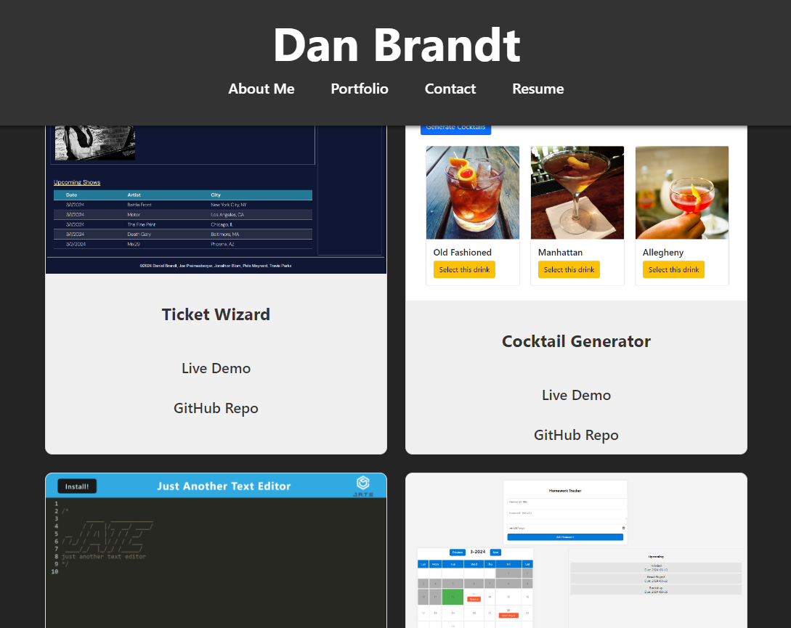

# Dan Brandt's Portfolio

## Description

Dan Brandt's Portfolio, a single-page application (SPA) developed using React and deployed on Netlify, which showcases my web development projects and highlights my skills in building responsive, user-friendly web applications.

## Table of Contents

- [Installation](#installation)
- [Usage](#usage)
- [Features](#features)
- [Deployed Application](#deployed-application)
- [Screenshots](#screenshots)
- [Technologies Used](#technologies-used)
- [Credits](#credits)
- [License](#license)

## Installation

To install the application, follow these steps:

1. Clone the repository to your local machine using:

```bash
git clone https://github.com/DB-Doo/main-portfolio.git
```

2. Navigate to the project directory:

```bash
cd main-portfolio
```

3. Install the necessary packages:

```bash
npm install
```

4. To start the application locally, run:

```bash
npm run dev
```

Navigate to `http://localhost:5173` to view the app.

## Usage

This portfolio is designed to be intuitive and easy to navigate. The navigation bar at the top allows users to quickly jump to different sections of the portfolio, including About Me, Portfolio, Contact, and Resume.

## Features

- **Responsive Design**: Ensures a seamless experience across various devices and screen sizes.
- **Single-Page Application**: Smooth navigation without the need for page reloads.
- **Dynamic Content**: React components are used to render content dynamically, making the portfolio engaging and interactive.

## Deployed Application

The portfolio is deployed on Netlify. Go check it out [here](https://danbrandt.netlify.app/)

## Screenshots





## Technologies Used

- React.js
- HTML
- CSS
- Netlify (Deployment)
- Vite

## Credits

Developed by Dan Brandt

## License
This project is licensed under the MIT License. For more details, visit [https://opensource.org/licenses/MIT](https://opensource.org/licenses/MIT).

---

© 2024 Dan Brandt. All Rights Reserved.

